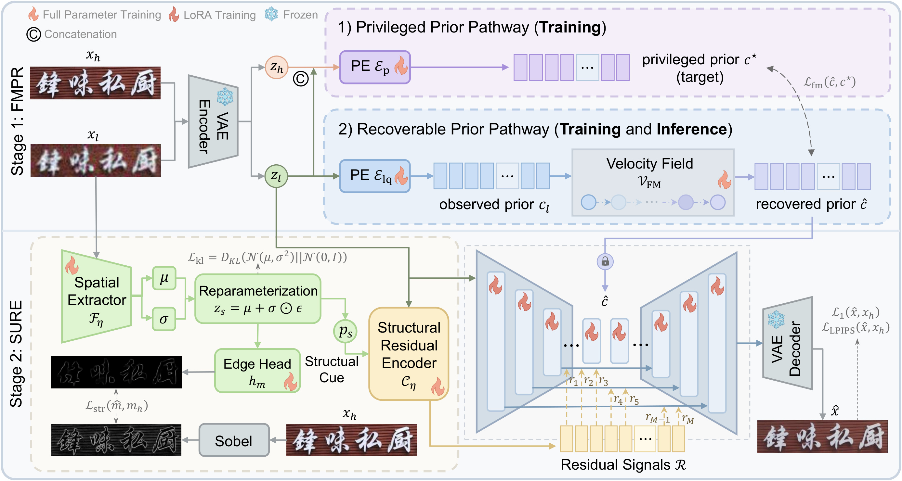
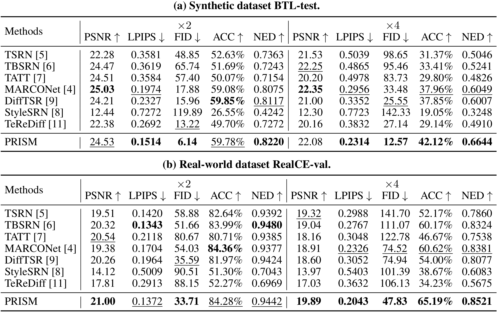
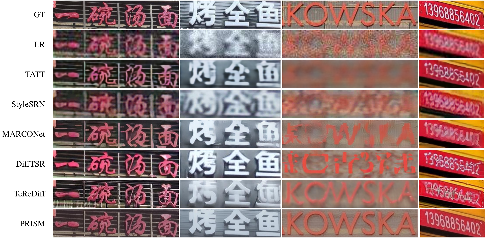
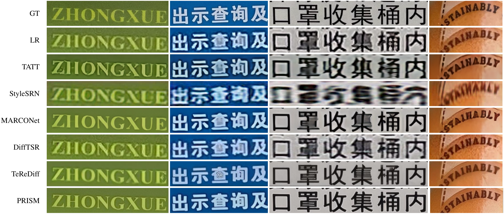

# PRISM: Prior Rectification and Uncertainty-Aware Structure Modeling for Diffusion-Based Text Image Super-Resolution

[Zihang Xu](https://github.com/faithxuz), [Xiaoyang Liu](https://xyliu339.github.io/), [Zheng Chen](https://zheng-chen.cn/), [Yulun Zhang](http://yulunzhang.com/), and [Xiaokang Yang](https://scholar.google.com/citations?user=yDEavdMAAAAJ&hl=en), "PRISM: Prior Rectification and Uncertainty-Aware Structure Modeling for Diffusion-Based Text Image Super-Resolution", arXiv, 2026.

[](https://github.com/faithxuz/PRISM)
[](https://github.com/faithxuz/PRISM)

[[arXiv](https://arxiv.org/abs/2605.13027)]

---

> **Abstract:** Text image super-resolution (Text-SR) requires more than visually plausible detail synthesis: slight errors in stroke topology may alter character identity and break readability. Existing methods improve text fidelity with stronger recognition-based or generative priors, yet they still face two unresolved challenges under severe degradation: the text condition extracted from low-quality inputs can itself be unreliable, and a plausible global prior does not fully determine fine-grained stroke boundaries. We present PRISM, a single-step diffusion-based Text-SR framework that addresses these two challenges through Flow-Matching Prior Rectification (FMPR) and a Structure-guided Uncertainty-aware Residual Encoder (SURE). FMPR constructs a privileged training-time prior from paired low-quality/high-quality latents and learns a flow matching that transports degraded embeddings toward this restoration-oriented prior space, yielding more accurate and reliable global text guidance. SURE further predicts uncertainty-aware structural residuals to selectively absorb reliable local boundary evidence while suppressing ambiguous stroke cues. Together, these components enable explicit global prior rectification and local structure refinement within a single diffusion restoration pass. Experiments on both synthetic and real-world benchmarks show that PRISM achieves state-of-the-art performance with millisecond-level inference.

---

## 💡 Methodology

<div align="center">
    
</div>

## <a name="results"></a>🔎 Results

<details open>
<summary>Quantitative Results</summary>

<p align="center">
    
</p>

</details>

<details open>
<summary>Visual Results</summary>

- Visual results on BTL-test:

<div align="center">
    
</div>

- Visual results on RealCE-val:

<div align="center">
    
</div>

</details>


## <a name="citation"></a>📎 Citation

```bibtex
@article{xu2026prismpriorrectificationuncertaintyaware,
  title={PRISM: Prior Rectification and Uncertainty-Aware Structure Modeling for Diffusion-Based Text Image Super-Resolution}, 
  author={Zihang Xu and Xiaoyang Liu and Zheng Chen and Yulun Zhang and Xiaokang Yang},
  journal={arXiv preprint arXiv:2605.13027},
  year={2026}
}
```


## 🔗 Contents

- [ ] Dataset
- [ ] Model
- [ ] Training
- [ ] Testing
- [x] Citation